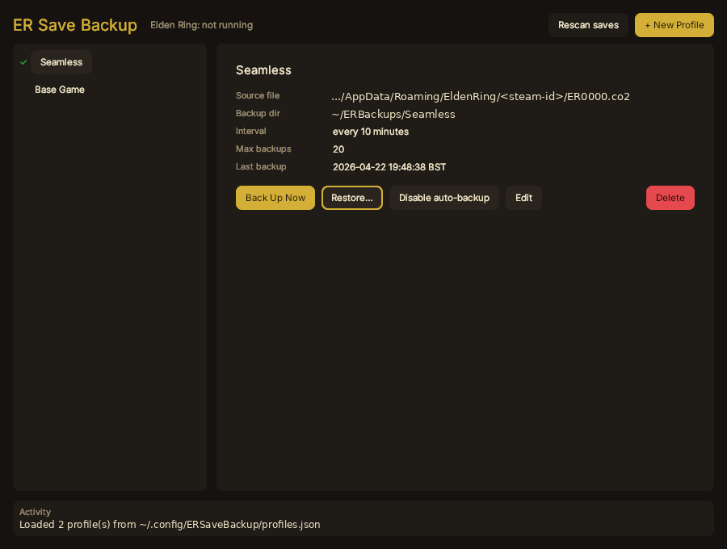
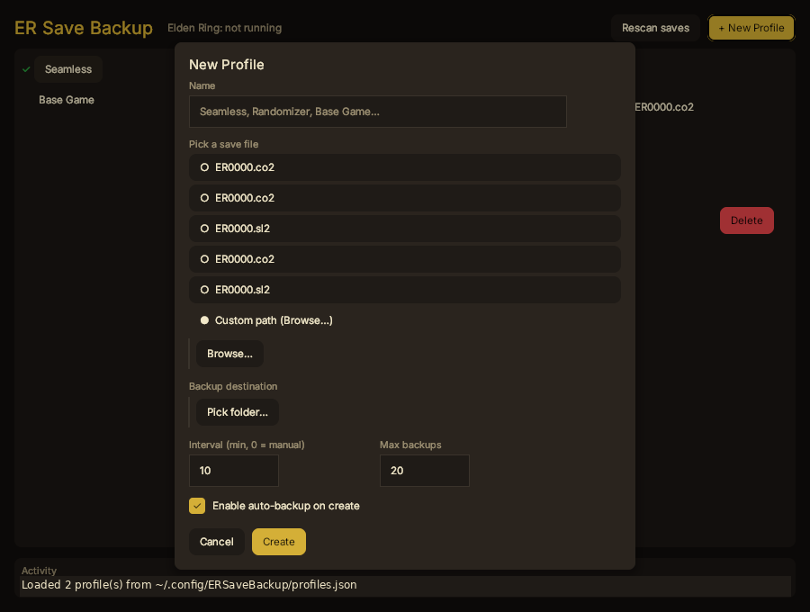
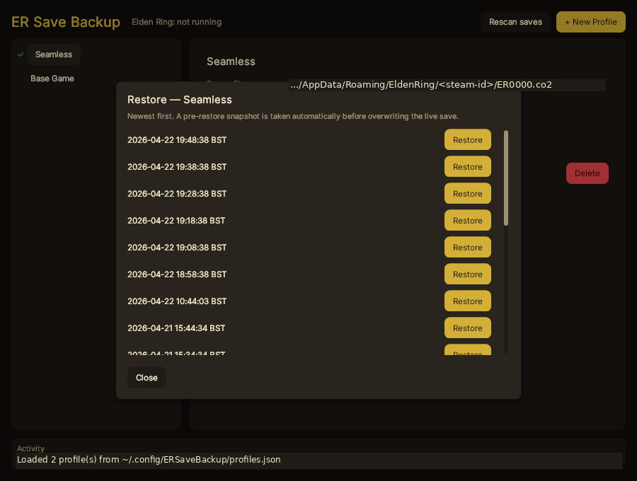

# ER Save Backup

A small desktop tool for keeping periodic backups of your Elden Ring saves while you play. It runs in a window, watches for the game process, and copies your save file to a folder you pick, on whatever interval you want.



I wrote the first version of this in raylib a while back for a single save file. This is the rewrite — same idea, but with multiple save profiles, so my vanilla save, my Seamless Co-op save and my randomizer save can each have their own schedule and their own destination without fighting over the same folder.

## What it does

- Watches for `eldenring.exe`. Auto-backups only fire while the game is actually running; when it's closed, the loop pauses.
- Manages one or more **profiles**. Each profile points at one save file (`.sl2`, `.co2`, `.rd2`) and one destination, with its own interval and its own cap on how many backups to keep.
- Finds your save files for you. On Linux it walks your Steam libraries to locate the Proton prefix for Elden Ring; on Windows it looks under `%APPDATA%\EldenRing`. If neither finds the file, there's a browse button.
- Restores from any previous backup. Before overwriting the live save it takes a pre-restore snapshot of the current file and keeps it for a week, so if you restore the wrong one you haven't lost anything.
- Config is one JSON file at `~/.config/ERSaveBackup/profiles.json` on Linux, or `%APPDATA%\ERSaveBackup\profiles.json` on Windows.

## Building

You need:

- [Odin](https://odin-lang.org) — a recent release.
- [Skald](https://github.com/BuLEEto/Skald) — the Odin GUI framework this app is built on.
- A Vulkan loader — comes with recent AMD / NVIDIA / Intel drivers on both Linux and Windows. If `vulkaninfo` works, you're fine; otherwise install the [Vulkan SDK](https://vulkan.lunarg.com/).
- **Windows only:** MSVC build tools (launch the build from an "x64 Native Tools" command prompt or a Developer PowerShell so `cl.exe` is on PATH).

Clone Skald next to this repo:

```
parent-dir/
├── Skald/
└── ERSaveBackup/
```

Then on Linux / macOS:

```sh
./build.sh          # compile to ./build/ersavebackup
./build.sh run      # compile and launch
```

Or on Windows:

```bat
build.bat           :: compile to build\ersavebackup.exe
build.bat run       :: compile and launch
```

If you keep Skald somewhere other than `../Skald`, point `GUI_PATH` at your checkout — `export GUI_PATH=/path/to/Skald` on Linux, or `set GUI_PATH=C:\path\to\Skald` on Windows.

The Windows script also copies `SDL3.dll` out of Odin's `vendor\sdl3\` and drops it next to the built `.exe`; without it, the binary won't start.

## Using it

1. Launch the app. The profile list on the left will be empty on first run.
2. Click **+ New Profile**. The dialog lists every Elden Ring save file it found on your system — pick one, name the profile, point it at a destination folder, set an interval and a max backup count, and hit Create.

   

3. Open Elden Ring. The header flips to *Elden Ring: running* once the app sees the process, and auto-backups start ticking on your interval. When the game closes they pause again.
4. **Back Up Now** takes an immediate backup regardless of game state — useful before you do something you're not sure about.
5. **Restore…** opens a list of every backup for the selected profile, newest first. Click Restore next to the one you want. The app takes a pre-restore snapshot of the current live save, then overwrites it.

   

## A few things worth knowing

- The green tick next to a profile in the list means auto-backup is *armed* for that profile — auto-backup is enabled and the interval is greater than zero. It doesn't mean a backup is happening right now; actual copies only fire while `eldenring.exe` is running.
- Don't restore while Elden Ring is running. The app blocks this on purpose: copying over a save file the game has open is how saves get corrupted.
- Pre-restore snapshots (`*_prerestore_*` files in your backup folder) don't count towards the per-profile max-backups cap, so restoring doesn't push older normal backups out. They auto-delete a week after they were taken.
- Timestamps in filenames are in your local time, not UTC. Your OS timezone is used.
- Closing the window stops all backup loops.

## Credits

- The [Odin language](https://odin-lang.org) and its standard library.
- [Skald](https://github.com/BuLEEto/Skald) — the Odin GUI framework this is built on.
- The old raylib version of this tool, which this replaced.

## License

MIT — see [LICENSE](LICENSE).
